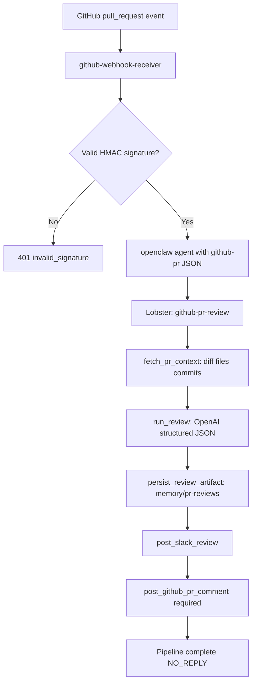

<h1 align="center">OpenClaw AI Agents for GitHub Pull Request Reviews</h1>

<p align="center">
  OpenClaw AI agents for GitHub pull request automation: webhook-triggered review analysis, Slack notifications, and a required GitHub comment.
</p>

<p align="center">
  
</p>

<p align="center">
  
  
  
  
  
  
  
</p>

An **OpenClaw** workflow for **AI agents** and **GitHub pull request** review automation: when GitHub sends a `pull_request` event, the webhook receiver runs `openclaw agent` with a `{{github-pr}}` payload. The pipeline fetches the PR, runs an **OpenAI** review, writes **`memory/pr-reviews/`**, posts to **Slack**, and posts a **summary comment on the PR**. The pipeline **fails** if the GitHub comment cannot be posted—ensure your PAT can create issue comments.

## Table of Contents

- [What This Project Does](#what-this-project-does)
- [Key Features](#key-features)
- [Flow Diagram](#flow-diagram)
- [Who This Is For (Use Cases)](#who-this-is-for-use-cases)
- [Folder Overview](#folder-overview)
- [Step-by-Step Install (Non-Technical Friendly)](#step-by-step-install-non-technical-friendly)
- [Daily Usage](#daily-usage)
- [How It Works](#how-it-works)
- [Environment Reference](#environment-reference)
- [Troubleshooting](#troubleshooting)
- [Docker and Traefik (openclaw-phase1)](#docker-and-traefik-openclaw-phase1)
- [Security Measures](#security-measures)
- [Uninstall](#uninstall)
- [License](#license)

## What This Project Does

This **OpenClaw setup for AI agents** helps you:

- Receive **`pull_request`** webhooks (`opened`, `synchronize`, `reopened`)
- Run a **deterministic Lobster pipeline** ([`workspace-pr-reviewer-github/workflow/pipelines/github-pr-review.lobster`](workspace-pr-reviewer-github/workflow/pipelines/github-pr-review.lobster))
- Produce a **structured review** via OpenAI (`workspace-pr-reviewer-github/scripts/run_review.mjs`)
- **Notify Slack** with summary + full markdown in a thread
- **Post the review as an issue comment** on the PR (GitHub REST: PR comments use the issue comments API)

## Key Features

- **Lobster-first pipelines** under [`workspace-pr-reviewer-github/workflow/pipelines/`](workspace-pr-reviewer-github/workflow/pipelines/) for repeatable automation
- **GitHub webhook receiver** with HMAC verification ([`workspace-pr-reviewer-github/github-webhook-receiver/`](workspace-pr-reviewer-github/github-webhook-receiver/))
- **Coalesced agent runs** to reduce duplicate triggers under rapid pushes
- **Persistent artifacts** in `memory/pr-reviews/` for auditing or git tracking
- **Example OpenClaw config** in [`openclaw.json.example`](openclaw.json.example)
- **Installer** copies [`workspace-pr-reviewer-github/`](workspace-pr-reviewer-github/) into `~/.openclaw/workspace-pr-reviewer-github` and merges agent bindings

## Flow Diagram



## Who This Is For (Use Cases)

- Teams that want **automated first-pass PR reviews** without merging or pushing from the bot
- Operators already running **OpenClaw Gateway** who use **Slack** for alerts
- Maintainers who want **review text mirrored** to both Slack and the PR thread
- Anyone wiring **GitHub → OpenClaw → Slack** with a **required** PR comment for traceability

## Folder Overview

| Path | Purpose |
|------|---------|
| [`workspace-pr-reviewer-github/`](workspace-pr-reviewer-github/) | Main agent workspace: `AGENTS.md`, Lobster pipelines, scripts, `prompts/`, `config/`, `memory/`, webhook receiver |
| [`workspace-pr-reviewer-github/workflow/pipelines/github-pr-review.lobster`](workspace-pr-reviewer-github/workflow/pipelines/github-pr-review.lobster) | Main Lobster pipeline (invoke with **absolute** path; see [`workspace-pr-reviewer-github/AGENTS.md`](workspace-pr-reviewer-github/AGENTS.md)) |
| [`workspace-pr-reviewer-github/workflow/pipelines/README.md`](workspace-pr-reviewer-github/workflow/pipelines/README.md) | Pipeline args and local script-chain test |
| [`workspace-pr-reviewer-github/workflow/WORKFLOW.md`](workspace-pr-reviewer-github/workflow/WORKFLOW.md) | Concise stage diagram and recovery notes |
| [`workspace-pr-reviewer-github/github-webhook-receiver/`](workspace-pr-reviewer-github/github-webhook-receiver/) | HTTP server → `openclaw agent` |
| [`scripts/`](scripts/) (package root) | `install-pr-reviewer.mjs`, `uninstall-pr-reviewer.mjs`, `parse_openclaw_config.mjs` |
| [`openclaw.json.example`](openclaw.json.example) | Merge into `~/.openclaw/openclaw.json` |
| [`workspace-pr-reviewer-github/AGENTS.md`](workspace-pr-reviewer-github/AGENTS.md), [`TOOLS.md`](workspace-pr-reviewer-github/TOOLS.md), [`SOUL.md`](workspace-pr-reviewer-github/SOUL.md) | Agent behavior and tooling contracts |

## Step-by-Step Install (Non-Technical Friendly)

### 1) Install OpenClaw First

Follow the official docs: [OpenClaw](https://docs.openclaw.ai/).

Complete onboarding once so your local config exists:

- Default path is usually `~/.openclaw/openclaw.json`

### 2) Download This Repo

Clone or download this repository to your computer.

### 3) Open Terminal in `pr-reviewer-github/`

Run:

```bash
npm run install-agent
```

What this does for you:

- Copies [`workspace-pr-reviewer-github/`](workspace-pr-reviewer-github/) to `~/.openclaw/workspace-pr-reviewer-github`
- Merges `pr-reviewer-github` into `~/.openclaw/openclaw.json` (backups are created if the file already exists)

To remove the agent later, run `npm run uninstall-agent`.

**Manual install:** copy the [`workspace-pr-reviewer-github/`](workspace-pr-reviewer-github/) folder to `~/.openclaw/workspace-pr-reviewer-github` yourself, then merge [`openclaw.json.example`](openclaw.json.example) into your live config by hand.

If you use a different `OPENCLAW_HOME`, set it before install:

```bash
export OPENCLAW_HOME=/path/to/.openclaw
```

### 4) Get Tokens and IDs

| Need | What it’s for | How to get it |
|------|----------------|---------------|
| **OpenClaw** | Run the agent and Gateway | [OpenClaw docs](https://docs.openclaw.ai/) — `openclaw onboard` and config under `~/.openclaw/openclaw.json` |
| **OpenAI API key** | The review model (`run_review.mjs`) | [OpenAI API keys](https://platform.openai.com/api-keys) (Dashboard → API keys) |
| **GitHub personal access token (PAT)** | List PR files/diffs, **post** review as an issue comment | [New classic token](https://github.com/settings/tokens/new) or [fine-grained](https://github.com/settings/personal-access-tokens): needs **read** to repo content/PRs and **write** to **issues** (PR comments are issue comments on the same number). For private org repos, ensure org policy allows the token. |
| **GitHub webhook secret** | HMAC validation on the receiver | Invent a long random string; use the *same* value in GitHub webhook settings and in `GITHUB_WEBHOOK_SECRET` in your env. |
| **Slack app — Bot token** | `chat.postMessage` to your review channel | [Slack API apps](https://api.slack.com/apps) → your app → **OAuth & Permissions** — install to workspace, copy **Bot User OAuth Token** (`xoxb-…`). [Scopes overview](https://api.slack.com/scopes) — you need at least `chat:write` for the destination channel. |
| **Slack channel ID** | Where reviews are posted (starts with `C`…) | In Slack, open the channel → channel name → **About** (or *View channel details*), copy the Channel ID, or [list channels in the app](https://api.slack.com/methods/conversations.list) with your token. |
| **OpenClaw Slack account** | Must match your `openclaw.json` `channels.slack.accounts` and `bindings` | If the installer added `default`, put `SLACK_APP_TOKEN` / `SLACK_BOT_TOKEN` / `SLACK_USER_TOKEN` in `~/.openclaw/.env` per [OpenClaw channels](https://docs.openclaw.ai/). Reuse the same bot token in `SLACK_BOT_TOKEN` for the pipeline, or set `PR_REVIEW_SLACK_CHANNEL_ID` to an allowed channel. |

**Documentation links (official):**

- [GitHub webhooks](https://docs.github.com/en/webhooks) — `pull_request` events  
- [GitHub REST: issue comments (PRs use issue number)](https://docs.github.com/en/rest/issues/comments)  
- [Slack: chat.postMessage](https://api.slack.com/methods/chat.postMessage)  
- [OpenClaw / Lobster (workflow tool)](https://docs.openclaw.ai/tools/lobster)

### 5) Environment Variables

Set these on the process that runs the **Gateway** and the **webhook receiver** (same `.env` is typical):

- `OPENAI_API_KEY` — from OpenAI  
- `GITHUB_TOKEN` or `GH_TOKEN` — from GitHub (must allow **posting** issue comments)  
- `GITHUB_WEBHOOK_SECRET` — shared with GitHub webhook configuration  
- `SLACK_BOT_TOKEN` — from Slack (same app as in OpenClaw, if you use that bot)  
- `PR_REVIEW_SLACK_CHANNEL_ID` — `C…` from Slack  
- `PR_REVIEWER_WORKSPACE` — absolute path to the installed workspace (default in Docker: `/home/node/.openclaw/workspace-pr-reviewer-github`)  

Use [`workspace-pr-reviewer-github/.env.example`](workspace-pr-reviewer-github/.env.example) as a template (copy values into `~/.openclaw/.env` or the receiver’s `.env`).

### 6) Register the GitHub Webhook

1. GitHub → repository **Settings** → **Webhooks** → **Add webhook**  
2. **Payload URL:** your public URL + path (e.g. `https://your-host/github-pr-webhook` if you use the phase1 Traefik path).  
3. **Content type:** `application/json`  
4. **Secret:** same as `GITHUB_WEBHOOK_SECRET`  
5. **Events:** *Let me select individual events* → enable **Pull requests**  
6. Save.

### 7) Start the Webhook Receiver and Gateway

From the installed workspace (or your deployment), start the receiver (see [`workspace-pr-reviewer-github/github-webhook-receiver/`](workspace-pr-reviewer-github/github-webhook-receiver/)):

```bash
cd ~/.openclaw/workspace-pr-reviewer-github/github-webhook-receiver
npm install   # once
node index.mjs
```

Then start OpenClaw:

```bash
openclaw doctor
openclaw gateway
```

Open a test PR: you should get a **Slack** message and a **comment on the PR** (if the token has the right permissions).

### 8) Binding Note (Slack)

The installer’s template uses the Slack `default` **account** in `openclaw.json`. If you already use another account (e.g. `clawslack`), copy the `peer.channel` binding and `accountId` from your working Slack setup and set `PR_REVIEW_SLACK_CHANNEL_ID` to a channel the bot is allowed to post in.

## Daily Usage

- **Normal operation:** open or update a PR → GitHub POSTs to your webhook → coalesced `openclaw agent` run → Slack summary + threaded detail → GitHub issue comment on the PR.
- **Artifacts:** each run can write under `memory/pr-reviews/` inside the workspace for audit or optional git tracking.
- **Local chain test (no Lobster UI):** from `~/.openclaw/workspace-pr-reviewer-github` with env set, see [`workspace-pr-reviewer-github/workflow/pipelines/README.md`](workspace-pr-reviewer-github/workflow/pipelines/README.md).

## How It Works

- **Trigger:** `pull_request` with actions `opened`, `synchronize`, `reopened`
- **Review:** `workspace-pr-reviewer-github/scripts/run_review.mjs` (OpenAI) with a structured JSON schema
- **Slack:** summary + full markdown in a thread
- **GitHub:** **required** issue comment on the PR (`POST .../issues/{n}/comments`)

Stages match [`workspace-pr-reviewer-github/workflow/WORKFLOW.md`](workspace-pr-reviewer-github/workflow/WORKFLOW.md): fetch → review → persist → Slack → GitHub comment.

## Environment Reference

| Variable | Role |
|----------|------|
| `OPENAI_API_KEY` | OpenAI |
| `GITHUB_TOKEN` / `GH_TOKEN` | Read PR + **post** issue comments |
| `GITHUB_WEBHOOK_SECRET` | Webhook HMAC |
| `SLACK_BOT_TOKEN` | `chat.postMessage` |
| `PR_REVIEW_SLACK_CHANNEL_ID` | Target channel |
| `PR_REVIEWER_WORKSPACE` | Absolute path to this workspace on the host |

See [`workspace-pr-reviewer-github/.env.example`](workspace-pr-reviewer-github/.env.example) for optional tuning (`PR_REVIEW_OPENAI_MODEL`, timeouts, etc.).

## Troubleshooting

| Symptom | Check |
|--------|--------|
| 401 on webhook | `GITHUB_WEBHOOK_SECRET` matches GitHub; or `ALLOW_INSECURE_WEBHOOK=1` only for local dev (no secret). |
| No GitHub comment | Token missing `issues: write` (fine-grained) or `repo` (classic) for that repo. |
| Slack fails | `PR_REVIEW_SLACK_CHANNEL_ID` and bot invited to channel; [channel allowlist in OpenClaw](https://docs.openclaw.ai/) matches. |

## Docker and Traefik (openclaw-phase1)

If you deploy with [`openclaw-phase1/docker-compose.yml`](../openclaw-phase1/docker-compose.yml), use:

- **`PR_REVIEWER_WORKSPACE_HOST_DIR`** — host path to this repo’s **`workspace-pr-reviewer-github/`** directory (synced to `/home/node/.openclaw/workspace-pr-reviewer-github`). This folder includes `github-webhook-receiver/` so the compose `working_dir` for the webhook service stays valid.
- `GITHUB_PR_WEBHOOK_PORT` (default 3457) and public URL for path `/github-pr-webhook`
- The compose file mounts the workspace into the **gateway** and **openclaw-cli** so the agent can read files and the receiver can spawn `openclaw`.

## Security Measures

This workflow is designed with safety-first defaults for real-world use.

### Built-In Security Controls

- **Webhook HMAC:** rejects unsigned or wrong-secret payloads (unless explicitly overridden for insecure local dev).
- **Untrusted PR content:** titles, bodies, and diffs are treated as data, not instructions (see [`workspace-pr-reviewer-github/AGENTS.md`](workspace-pr-reviewer-github/AGENTS.md)).
- **Least-privilege PAT intent:** token needs read access to PR material and write only for issue comments—not merge or push from this pipeline alone.
- **No secrets in workspace files:** tokens live in environment variables (see [`workspace-pr-reviewer-github/.env.example`](workspace-pr-reviewer-github/.env.example)).
- **Deterministic Lobster flow:** reduces ad-hoc shell risk compared to unconstrained agent loops for the automated path.

### Operator Hardening Checklist

- Restrict who can reach the webhook URL; terminate TLS at the edge (e.g. Traefik).
- Use a dedicated Slack channel for bot noise; invite only needed operators.
- Rotate GitHub and Slack tokens on a schedule; revoke immediately if exposed.
- Prefer fine-grained PATs scoped to the repositories that need reviews.
- Do not enable `ALLOW_INSECURE_WEBHOOK` in production.

## Uninstall

From `pr-reviewer-github/`:

```bash
npm run uninstall-agent
```

You will be prompted to delete `~/.openclaw/workspace-pr-reviewer-github` and `~/.openclaw/agents/pr-reviewer-github`.

## License

OpenClaw, Lobster, GitHub API, Slack API, and OpenAI are subject to their respective terms. Use and modify this package in line with your parent project’s license.
# OpenClaw-AI-Agents-for-GitHub-Pull-Request-Reviews
