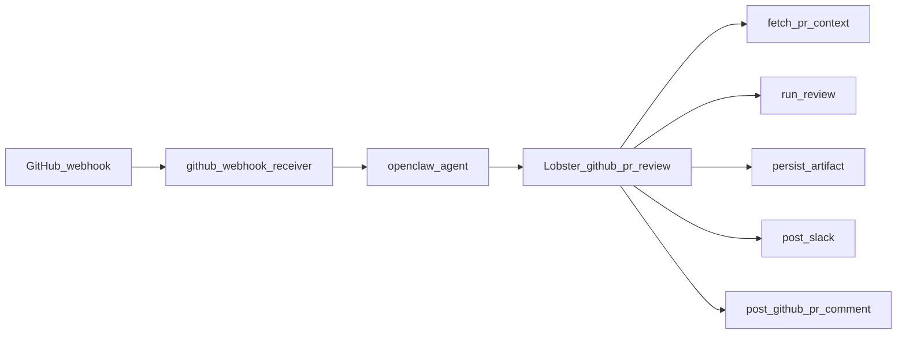

# WORKFLOW.md — PR Reviewer

## Flow

## Stages (concise)

1. **Trigger:** `pull_request` actions `opened`, `synchronize`, `reopened`.
2. **Fetch:** API diff (capped) + file list + commits; filter by `config/reviewable-extensions.json` and ignore bad extensions.
3. **Review:** Model returns structured JSON + markdown.
4. **Persist:** write `memory/pr-reviews/…` (markdown archive you can track in git).
5. **Slack:** summary + full report in thread.
6. **GitHub:** issue (PR) comment with summary + full report (run fails if the API rejects).

## Recovery

- No separate recovery hook. Re-run the webhook (or `openclaw agent` with a synthetic `{{github-pr}}` JSON) to retry.

See `TOOLS.md` for script names; see [`README.md`](../../README.md) for operator setup.
